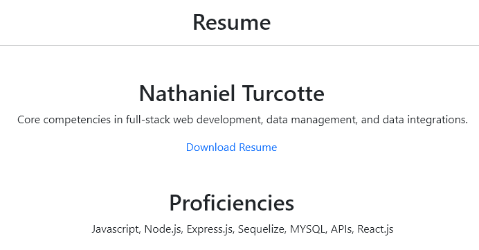
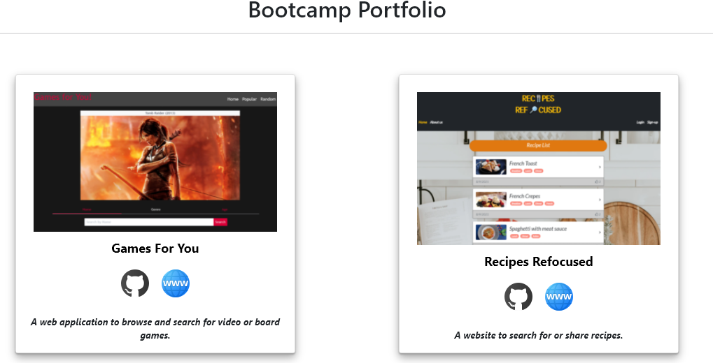
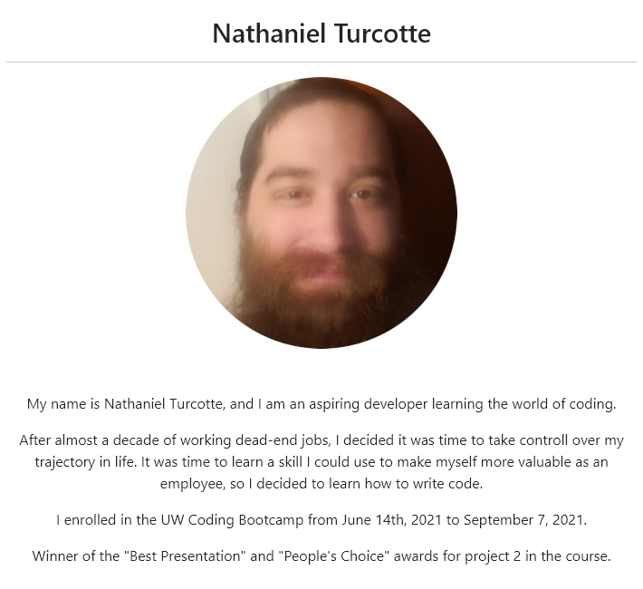

# React Portfolio

Deployed <a href="https://njt-react-portfolio.herokuapp.com">here</a>.

## Table of Contents

- [Instructions](#instructions)
- [Questions](#questions)
- [License](#license)

## Description:

This project is my portfolio updated to be constructed using React.js. The portfolio has gone from being a standard HTML page, to being a reactive webpage that displays information based on which nav button the user clicks on.

## Instructions

1. Follow this <a href="https://njt-react-portfolio.herokuapp.com">link</a> to navigate to my portfolio.
2. Click on the `Resume` button to navigate to my resume.
    * Here you can view my proficiencies as well as a link to my resume pdf

    

3. Click on the `Portfolio` button to navigate to my projects.
    * Here you can view my recent or outstanding projects.

    

4. Click on the `About Me` button to navigate to the about me portion of my portfolio.

    

5. The three buttons in the footer are links to my contacts.

    
    * GitHub
    * LinkedIn
    * Email

## Quesions

If you have any questions, contact me <a href="https://github.com/TheHebi" target="_blank">here</a>, or send me an email at nturcotte8@live.com.

## License

This project uses the MIT License
